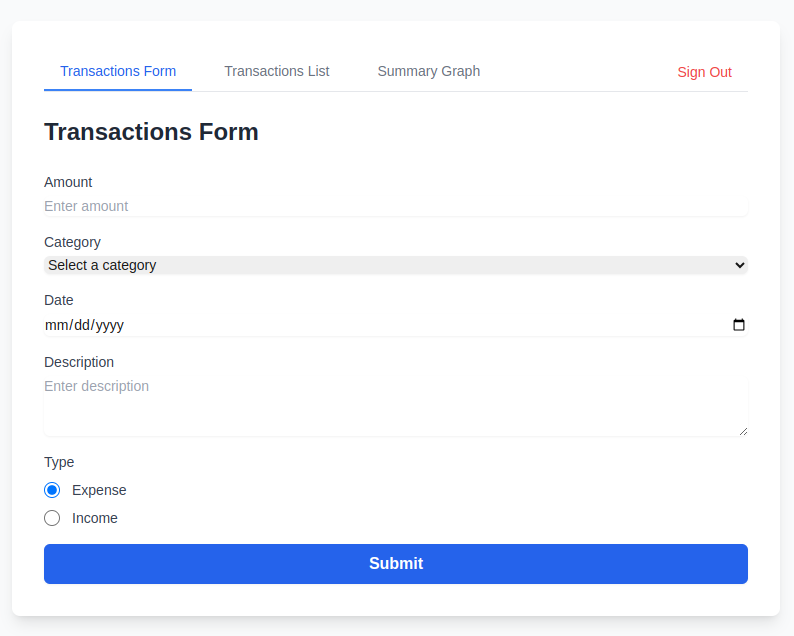
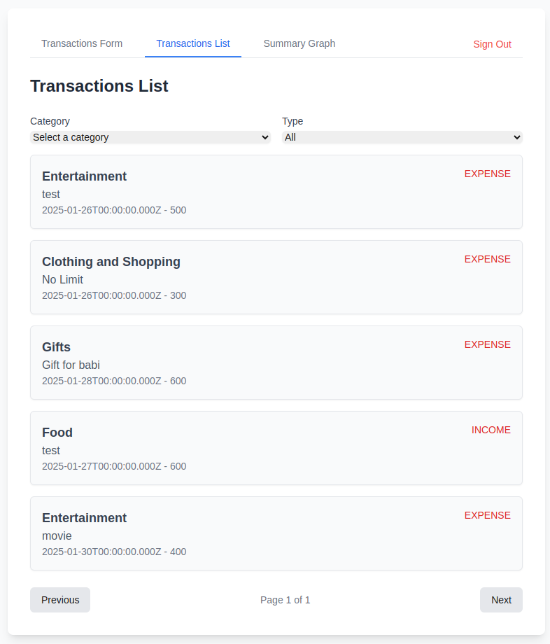
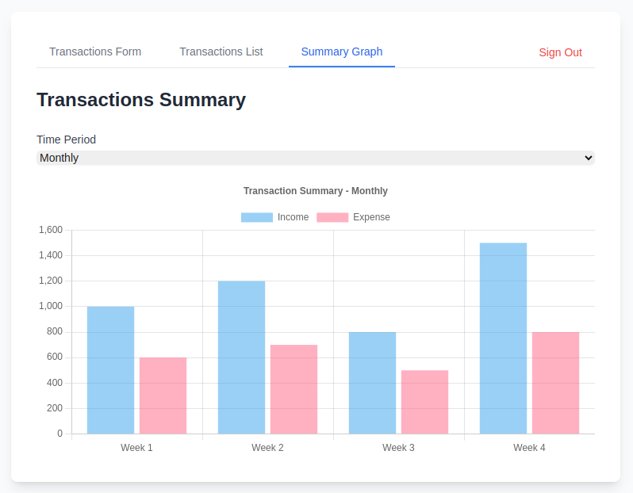

# Expense Tracker 2025



Expense Tracker 2025 is a modern web application designed to help users manage their personal finances by tracking income and expenses. It provides an intuitive interface for adding, editing, and categorizing transactions, as well as generating summaries and reports.

---

## Features

- **Add Transactions**: Easily add income or expense transactions with details like amount, category, date, and description.
- **Filter Transactions**: Filter transactions by category, type (income/expense), and date range.
- **Pagination**: View transactions in a paginated list for better performance with large datasets.
- **Categories**: Manage and select from predefined categories for transactions.
- **Summary**: View a summary of total income, expenses, and net balance.
- **Responsive Design**: Works seamlessly on desktop, tablet, and mobile devices.

---

## Tech Stack

Expense Tracker 2025 is built using the following technologies:

- **Frontend**:

  - [Next.js](https://nextjs.org/) - React framework for server-side rendering and static site generation.
  - [Tailwind CSS](https://tailwindcss.com/) - Utility-first CSS framework for styling.
  - [React Hook Form](https://react-hook-form.com/) - Form management library.
  - [Chart.js](https://www.chartjs.org/) - For generating visual summaries and reports.

- **Backend**:

  - [Next.js API Routes](https://nextjs.org/docs/api-routes/introduction) - For building the backend API.
  - [Prisma](https://www.prisma.io/) - ORM for database management.
  - [SQLite](https://www.sqlite.org/index.html) - Lightweight database for local development (can be replaced with PostgreSQL/MySQL for production).

- **Authentication**:

  - [NextAuth.js](https://next-auth.js.org/) - For user authentication and session management.

- **Deployment**:
  - [Vercel](https://vercel.com/) - For hosting and deployment.

---

## Getting Started

Follow these steps to set up and run the Expense Tracker 2025 project locally.

### Prerequisites

- [Node.js](https://nodejs.org/) (v16 or higher)
- [Git](https://git-scm.com/)
- [SQLite](https://www.sqlite.org/index.html) (or another database of your choice)

### Installation

1. **Clone the repository**:

   ```bash
   git clone https://github.com/surendias/expense-tracker-2025.git
   cd expense-tracker-2025
   ```

2. **Install dependencies**:

   ```bash
   npm install
   ```

3. **Set up the database**:

   - Create a `.env` file in the root directory and add the following environment variables:
     ```env
     DATABASE_URL="file:./dev.db"
     NEXTAUTH_SECRET="your-secret-key"
     NEXTAUTH_URL="http://localhost:3000"
     ```
   - Run the Prisma migration to set up the database schema:
     ```bash
     npx prisma migrate dev --name init
     ```

4. **Seed the database (optional)**:

   - If you want to populate the database with sample data, run:
     ```bash
     npx prisma db seed
     ```

5. **Run the development server**:

   ```bash
   npm run dev
   ```

6. **Open the application**:
   - Visit `http://localhost:3000` in your browser.

---

## Self-Hosting

To self-host Expense Tracker 2025, follow these steps:

### 1. **Deploy to Vercel**

- Fork this repository.
- Sign up for a [Vercel](https://vercel.com/) account.
- Import the forked repository into Vercel.
- Add the required environment variables in the Vercel dashboard:
  - `DATABASE_URL`
  - `NEXTAUTH_SECRET`
  - `NEXTAUTH_URL`
- Deploy the application.

### 2. **Deploy to a Custom Server**

- Clone the repository to your server.
- Install dependencies:
  ```bash
  npm install
  ```
- Build the project:
  ```bash
  npm run build
  ```
- Start the production server:
  ```bash
  npm start
  ```
- Use a reverse proxy (e.g., Nginx) to serve the application.

### 3. **Database Configuration**

- Replace SQLite with a production-ready database like PostgreSQL or MySQL.
- Update the `DATABASE_URL` in the `.env` file to point to your production database.

---

## Contributing

Contributions are welcome! If you'd like to contribute to Expense Tracker 2025, follow these steps:

1. Fork the repository.
2. Create a new branch for your feature or bugfix:
   ```bash
   git checkout -b feature/your-feature-name
   ```
3. Commit your changes:
   ```bash
   git commit -m "Add your feature"
   ```
4. Push to the branch:
   ```bash
   git push origin feature/your-feature-name
   ```
5. Open a pull request.

---

## License

This project is licensed under the MIT License. See the [LICENSE](./LICENSE) file for details.

---

## Screenshots






---

## Acknowledgments

- [Next.js Documentation](https://nextjs.org/docs)
- [Prisma Documentation](https://www.prisma.io/docs)
- [Tailwind CSS Documentation](https://tailwindcss.com/docs)

---

## Contact

For questions or feedback, feel free to reach out:

- **Suren Dias**: [GitHub](https://github.com/surendias) | [Email](mailto:suren@surendias.com)
